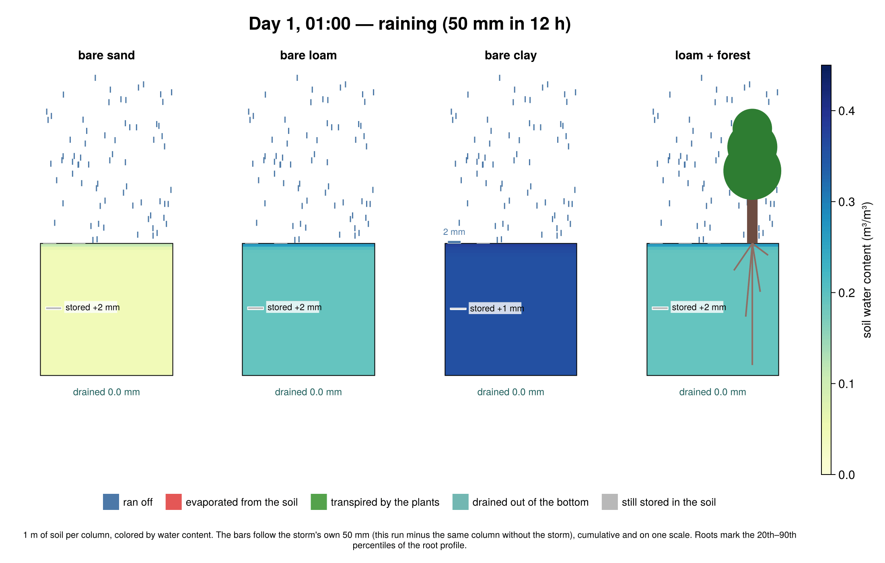

<!-- Draft for the CliMA blog. Figures are in figs/, the runnable snippet is snippet.jl, the full experiment is rain_experiment.jl + plot_results.jl -->

*CliMA software stack · Part 8 · ClimaLand.jl*

# A sponge, a straw, and fifty millimeters of rain

Every raindrop that hits the ground has four ways out. Which one it takes is decided by the soil and the plants, and that decision shapes floods, droughts, heat waves, and rivers. ClimaLand.jl is the part of the CliMA Earth system model that makes it.

*Alexis Renchon and the ClimaLand team · September 2026*

Picture a July night in the middle of a continent. A storm rolls through and drops fifty millimeters of rain in twelve hours, enough to fill a coffee mug set out on the porch. By morning the sun is back. Where does the water go?

On land, a raindrop has four exits. It can **run off** the surface into a ditch and a river. It can **drain** down through the soil toward groundwater. It can **evaporate** straight back from the wet ground. Or it can be pulled up through the roots and leaves of a plant and **transpired** into the air. Averaged over the continents, the last two exits together take back roughly sixty percent of all the rain that falls, and transpiration by plants is the larger of the two. The land surface acts as a valve between the rain and the atmosphere.

How the valve is set matters far beyond hydrology. Water that evaporates cools the surface; water that cannot evaporate lets it heat up, which is why the great European heat waves of 2003 and 2022 followed dry springs. Water that stays in the soil is the memory of the climate system on land: a wet April is still felt in July. And every molecule of water that leaves through a stoma pays for a molecule of carbon dioxide coming in, so the water valve and the carbon cycle are one mechanism seen from two sides.

ClimaLand.jl is the land model of the CliMA Earth system model. It computes this partition, along with the energy and carbon exchange that go with it, on a single column or on the whole globe, on CPUs or GPUs, and it is written so that its parameters can be learned from data with the calibration tools we introduced in the [previous post](https://clima.caltech.edu/2026/09/08/from-tuning-by-hand-to-learning-from-data-climaparams-jl-and-climacalibrate-jl/). Rather than tour the code, let us run the storm.



***The same storm on five columns.** Each column is two meters of soil, colored by water content, simulated hour by hour with ClimaLand for thirty days after a 50 mm storm that falls between midnight and noon on day 1. The blue pond above a column is the rain that ran off; the bar below is what drained out the bottom; the red arrow is the water returned to the air by evaporation and transpiration, averaged over the last 24 hours. Roots are drawn to scale. The weather is idealized and identical for all five: 22 to 34 °C days, half-saturated air, clear skies after the storm.*

## The sponge

Soil is a sponge, and like a kitchen sponge it has two properties that matter: how fast water gets in, and how tightly it is held once inside. Both are set by the size of the pores, which is to say by texture. Sand has large pores that let water through quickly and hold it weakly. Clay has pores a thousand times narrower that admit water slowly and grip it hard. Loam is in between.

ClimaLand describes water movement in soil with the Richards equation, a statement that water flows from high to low pressure, plus gravity, with a conductivity that depends steeply on how wet the soil already is. The texture enters through a handful of numbers, the van Genuchten parameters, that specify the retention curve and the saturated conductivity. Alongside water, the model solves for the soil's temperature and for freezing and thawing, because these feed back on each other: ice blocks pores, and evaporation cools the surface.

To see the sponge at work we ran three bare columns, identical in every way except their texture. All three start at the same suction, about the dryness at which a plant would still be comfortable, which means they start with very different amounts of water: sand at that suction is nearly dry, clay is nearly full.


***Water content through depth and time.** In sand the wetting front races downward and the surface is dry within hours. In loam the front stalls near 40 cm and the sun then pulls most of the storm back out through the surface over the following weeks. In clay the surface pores cannot admit rain at 4 mm per hour, so 35 mm of the 50 run off before they ever enter the soil.*

The three textures send the same fifty millimeters to three different exits. **Sand swallows it and hides it.** The surface dries in hours, and once the top few centimeters are dry they act as a mulch that cuts the soil off from the sun: only 4 mm evaporate in a month, and 46 mm are still sitting 30 to 60 cm down at the end. **Loam gives it back to the sky.** The storm wets the top half meter, capillary flow keeps feeding the surface, and 38 of the 50 mm evaporate, most of them in the first week. **Clay refuses it.** With a saturated conductivity of about two millimeters per hour, the clay surface can only take in a fraction of the rain; 70 percent runs off, and the little that entered leaves again by evaporation, along with 22 mm of the water that was in the clay before the storm, because a wet clay surface evaporates like a lake.

All of these numbers come out of the same equations, driven by the same weather, with only the pore sizes changed.

## The straw

Now put plants on the loam. A plant is a straw stuck into the sponge: roots at the bottom, stomata at the top. The pull on this straw comes from the dry air. Water evaporates from the wet walls inside a leaf, and the drier and warmer the air, the stronger that pull, which physiologists measure as the vapor pressure deficit. The tension is transmitted down a continuous column of water through the xylem to the roots, and from there into the soil. A tall tree on a hot afternoon is holding its water column at a tension of one to two megapascals, ten to twenty times atmospheric pressure, in the negative direction.

The plant can, however, bite the straw. Stomata close when the leaf water tension gets dangerously high, trading away photosynthesis to avoid the embolisms that would snap the water column. In ClimaLand the canopy model carries all of this explicitly: a leaf area and a root profile, a plant hydraulics model that tracks the water potential inside the plant, root uptake from each soil layer driven by the potential difference, and a stomatal model that closes as the leaf potential falls.

**The sponge.** Pore size sets how fast rain gets in (sand: minutes; clay: hours, with the rest running off) and how tightly it is held (sand: barely; clay: like a vice). Bare soil can only return water to the air from its top few centimeters.

**The straw.** Roots reach water the sun cannot. The dry air provides the suction; the plant sets the depth of the straw with its roots and can throttle the flow with its stomata. A forest spends the sponge's water faster than the sun can.

We added two kinds of vegetation to the loam column: a grassland with two square meters of leaf per square meter of ground and roots concentrated in the top 30 cm, and a forest with five square meters of leaf and roots reaching a meter down.


***Biting the straw.** Top: water returned to the air each day. The bare columns fall silent within a week; the vegetated columns keep going at 5 to 9 mm per day, the forest for longest because its roots reach deeper water. Bottom: the daily minimum leaf water potential in the plants (solid) and the resulting stomatal opening factor (dashed). Around day 10 the forest's leaves reach a tension of two megapascals and its stomata close; transpiration then falls to what the drying soil can supply, and photosynthesis with it.*

Plants draw the sponge down faster than the sun can. In the first week the forest returns nine millimeters a day to the air, more than the bare loam ever managed, because roots reach water the sun cannot. By day ten the loam within reach of the roots has dried to the point where the forest's leaves are at two megapascals of tension at midday, and the stomata shut. The grass follows a few days later; its shallow roots exhaust the top layer, then it survives on a trickle from below. Vegetation does, however, keep feeding the *atmosphere*: the grass and the forest return water vapor, and with it cooling, into the air for weeks after the bare soils have gone quiet.


***Where did the rain go?** The fate of the storm after thirty days. Bars to the right of zero are the four exits plus what is still in the soil. Bars to the left are water the column lost beyond the storm, drawn from what it held before the rain. The grass spent 45 mm of pre-storm water on top of the storm; the forest spent 74 mm, of which about 26 mm came out of the trees' own tissue, which is what a forest's water potential dropping by two megapascals looks like in millimeters.*

Over thirty days the forest transpired 107 mm, more than twice the rain that fell, and the grassland 74 mm. Both columns ended the month drier than they started. This is the everyday physics behind two things that sound like paradoxes: that planting trees can lower a water table, and that a forest is cooler than a field on a summer afternoon while making the ground beneath it drier.

## One model for the land, from a column to the globe

The five columns above use two of ClimaLand's component models: the soil model, which solves for water, ice, and heat, and the canopy model, which handles radiative transfer through the leaves, photosynthesis, stomatal conductance, plant hydraulics, and the canopy's own energy balance. ClimaLand also has a snow model, a model of soil carbon and the CO₂ that microbes breathe out through the soil, a simple lake model, and a single-layer bucket model for fast experiments. Each component runs on its own, and they compose into integrated land models that exchange water, energy, and carbon at the interfaces between them, with the same conservation bookkeeping whether the model runs on one column or on a global cubed-sphere grid.

Under the hood it is built on the same foundations as the rest of the stack. ClimaCore.jl supplies the grids and operators, so the same source runs on a laptop CPU and on a cluster of GPUs. Physical constants and every tunable parameter live in ClimaParams.jl, which is what makes the model calibratable: we fit parameters of the soil, canopy, and snow components against flux towers and satellite products with ClimaCalibrate.jl, using the ensemble Kalman methods from the [calibration post](https://clima.caltech.edu/2026/09/01/how-can-we-fit-a-climate-model-to-observations-when-no-one-can-predict-the-weather-a-month-from-now/). And ClimaLand is a citizen of the coupled model: the same code that ran the storm above receives its rain, sun, and wind from the CliMA atmosphere in the full Earth system model.

  - **Soil**: Richards equation for water, heat conduction and phase change, van Genuchten hydraulics, surface and subsurface runoff, evaporation and sublimation with a dry-surface-layer resistance.
  - **Canopy**: two-stream radiative transfer, Farquhar or P-model photosynthesis (C3 and C4), Medlyn or optimality-based stomatal conductance, plant hydraulics with root uptake by soil layer, a big-leaf energy balance, and prescribed or prognostic leaf area.
  - **Snow**: a bulk snowpack with its own energy balance, albedo, and melt.
  - **Soil carbon**: heterotrophic respiration and CO₂ diffusion through the soil pores.
  - **Integrated models**: soil + canopy, soil + canopy + snow, with or without soil carbon; a bucket model; global and site-level drivers for ERA5 reanalysis, FLUXNET towers, and MODIS leaf area.

## See for yourself

The script below builds the bare-loam column and the forest column from the animation, runs them for thirty days, and plots the soil water content through time along with the water returned to the air. Both simulations together take under a minute on a laptop once the packages are compiled. It needs ClimaLand and CairoMakie installed, along with ClimaUtilities, ClimaDiagnostics, Insolation, and Thermodynamics, which come with ClimaLand.

```julia
# Where does the rain go? A 2 m soil column, bare or under a forest,
# hit by a 50 mm storm on the first night of an idealized July, then 29 dry days.
using Dates, ClimaLand, ClimaLand.Soil, ClimaLand.Canopy, CairoMakie
using ClimaLand.Domains: Column, obtain_surface_domain
using ClimaUtilities.TimeVaryingInputs: TimeVaryingInput
import ClimaLand.Parameters as LP, ClimaLand.Simulations as Sim
import ClimaParams, ClimaDiagnostics, Thermodynamics as TD, Insolation

FT = Float64
toml_dict = LP.create_toml_dict(FT)
params = LP.LandParameters(toml_dict)

# --- the place and the weather
long, lat = -92.2, 38.7                 # Missouri: sets the sun's path and default parameter maps
domain = Column(; zlim = (-2.0, 0.0), nelements = 30, dz_tuple = (0.2, 0.025), longlat = (long, lat))
start_date = DateTime(2010, 7, 1, 6)    # 00:00 local time
seconds(t) = float(t)                   # simulation time → seconds since start_date
raining(t) = seconds(t)  0.0),
    TimeVaryingInput(T_air), TimeVaryingInput(t -> 2.0), TimeVaryingInput(q_air),
    TimeVaryingInput(t -> 101325.0), start_date, FT(20), toml_dict)
radiation = ClimaLand.PrescribedRadiativeFluxes(FT, TimeVaryingInput(SW_d), TimeVaryingInput(LW_d), start_date;
    toml_dict, cosθs = (t, s) -> ClimaLand.default_cos_zenith_angle(t, s; insol_params = params.insol_params, longitude = long, latitude = lat))
forcing = (; atmos, radiation)

# --- the soil: a loam (van Genuchten parameters from Carsel & Parrish, 1988)
loam = (; ν = 0.43, θ_r = 0.078, K_sat = 2.89e-6, hydrology_cm = vanGenuchten{FT}(; α = 3.6, n = 1.56))
soil(; kw...) = Soil.EnergyHydrology{FT}(domain, forcing, toml_dict; retention_parameters = loam,
    composition_parameters = (; ν_ss_om = 0.0, ν_ss_quartz = 0.4, ν_ss_gravel = 0.0), S_s = 1e-3,
    runoff = Soil.Runoff.SurfaceRunoff(), bottom_bc = Soil.EnergyWaterFreeDrainage(), kw...)
bare = soil()

# --- the same soil under a forest: 5 m² of leaves per m² of ground, roots reaching ~1 m
components = (:canopy, :soil, :soilco2)
surface = obtain_surface_domain(domain)
LAI = TimeVaryingInput(t -> 5.0)
canopy = Canopy.CanopyModel{FT}(surface, (; atmos, radiation, ground = ClimaLand.PrognosticGroundConditions{FT}()), LAI, toml_dict;
    prognostic_land_components = components,
    biomass = Canopy.PrescribedBiomassModel{FT}(surface, LAI, toml_dict; rooting_depth = 1.0, height = 2.0),
    hydraulics = Canopy.PlantHydraulicsModel{FT}(surface, toml_dict; retention_model = Canopy.LinearRetentionCurve{FT}(5e-5)),
    photosynthesis = Canopy.FarquharModel{FT}(surface, toml_dict),
    conductance = Canopy.MedlynConductanceModel{FT}(surface, toml_dict))
forest = SoilCanopyModel{FT}(forcing, LAI, toml_dict, domain;
    soil = soil(; prognostic_land_components = components, additional_sources = (ClimaLand.RootExtraction{FT}(),)), canopy)

# --- initial state: every layer at a suction of 2 m (≈ −20 kPa), the plant in equilibrium with it
function set_ic!(Y, p, t0, model)
    s = model isa SoilCanopyModel ? model.soil : model
    (; ν, θ_r, hydrology_cm, ρc_ds) = s.parameters
    Y.soil.ϑ_l .= θ_r + Soil.inverse_matric_potential(hydrology_cm, -2.0) * (ν - θ_r)
    Y.soil.θ_i .= 0
    ρc = Soil.volumetric_heat_capacity.(Y.soil.ϑ_l, Y.soil.θ_i, ρc_ds, params)
    Y.soil.ρe_int .= Soil.volumetric_internal_energy.(Y.soil.θ_i, ρc, T_air(0.0), params)
    if model isa SoilCanopyModel
        for (dst, src) in ((p.drivers.T, atmos.T), (p.drivers.P, atmos.P), (p.drivers.q, atmos.q), (p.drivers.c_co2, atmos.c_co2))
            ClimaUtilities.TimeVaryingInputs.evaluate!(dst, src, t0)
        end
        Sim.set_soilco2_initial_conditions!(Y, p, model)
        h = model.canopy.hydraulics.parameters
        ψ_plant = -2.0 - (model.canopy.biomass.height / 2 + model.canopy.biomass.rooting_depth)
        Y.canopy.hydraulics.ϑ_l .= Canopy.augmented_liquid_fraction(h.ν, Canopy.inverse_water_retention_curve(h.retention_model, ψ_plant, h.ν, h.S_s))
        Y.canopy.energy.T .= T_air(0.0)
    end
end
import ClimaUtilities

# --- run both for 30 days, saving hourly means
function run(model, vars)
    writer = ClimaDiagnostics.Writers.DictWriter()
    diagnostics = ClimaLand.default_diagnostics(model, start_date; output_writer = writer, output_vars = vars, reduction_period = :hourly)
    sim = Sim.LandSimulation(start_date, start_date + Day(30), 60.0, model; set_ic!, updateat = Second(60), user_callbacks = (), diagnostics)
    Sim.solve!(sim)
    return writer
end
out_bare = run(bare, ["swc", "et"])
out_forest = run(forest, ["swc", "et"])

# --- plot: soil water content through depth and time, and the water returned to the air
z = vec(parent(domain.fields.z))
swc(w) = (d = w["swc_1h_average"]; ts = sort(collect(keys(d))); (float.(ts) ./ 86400, reduce(hcat, vec(parent(d[t])) for t in ts)))
et(w, scale) = (d = w["et_1h_average"]; ts = sort(collect(keys(d))); (float.(ts) ./ 86400, [only(parent(d[t])) * scale for t in ts]))
fig = Figure(size = (1000, 640))
for (i, (name, w)) in enumerate(("bare loam" => out_bare, "loam + forest" => out_forest))
    days, θ = swc(w)
    ax = Axis(fig[1, i]; title = name, xlabel = "days since the storm", ylabel = "depth (m)")
    hm = heatmap!(ax, days, z, permutedims(θ); colormap = :YlGnBu, colorrange = (0, 0.45))
    i == 2 && Colorbar(fig[1, 3], hm; label = "soil water content (m³/m³)")
end
ax = Axis(fig[2, 1:2]; xlabel = "days since the storm", ylabel = "water to the air (mm/day)")
lines!(ax, et(out_bare, 8.64e7)...; label = "bare loam", linewidth = 2)       # soil model: m/s → mm/day
lines!(ax, et(out_forest, 86400.0)...; label = "loam + forest", linewidth = 2) # coupled model: kg/m²/s → mm/day
axislegend(ax)
save("where_does_the_rain_go.png", fig)
```


***What the script produces.** Change `loam` to sand or clay, the leaf area, or the rooting depth, and rerun.*

The complete experiment, with all five columns, the water budget, and the code for the animation, is in [rain_experiment.jl](rain_experiment.jl) and [plot_results.jl](plot_results.jl). The [ClimaLand documentation](https://clima.github.io/ClimaLand.jl/stable/) has tutorials that go from a single soil column to a global simulation driven by reanalysis data.

> **Notes on the setup**
>
>   **Weather.** The forcing is idealized so that the five columns differ only in soil and vegetation: a clear-sky July day at 38.7 °N with 22 to 34 °C air, 50 percent relative humidity, a 2 m/s wind, and the sun's path computed for the date; the storm brings 95 percent humidity and overcast skies for its twelve hours. All columns start at a matric potential of −2 m (about −20 kPa) at every depth, with a free-drainage boundary at 2 m.

>   **Soils.** Van Genuchten parameters are the textbook values of Carsel and Parrish (1988): sand (porosity 0.43, residual 0.045, α = 14.5 m⁻¹, n = 2.68, Ksat = 8.3 × 10⁻⁵ m/s), loam (0.43, 0.078, 3.6, 1.56, 2.9 × 10⁻⁶) and clay (0.38, 0.068, 0.8, 1.09, 5.6 × 10⁻⁷). Field clays with cracks and worm channels admit water faster than this; the 70 percent runoff is what a sealed clay surface does.

>   **Plants.** Grass: leaf area index 2, canopy height 0.5 m, rooting depth 0.3 m. Forest: leaf area index 5, height 2 m, rooting depth 1 m. Two choices depart from ClimaLand's defaults. We use the Farquhar–Medlyn photosynthesis and stomatal pathway so that stomata respond to leaf water potential within the hour; the default P-model applies water stress through a roughly two-week acclimation, which is appropriate for seasonal simulations but too slow to show in a thirty-day dry-down. And we set the plant's water storage capacitance to about ten millimeters per megapascal for the forest, in the range measured for real stands; the default value is an order of magnitude larger and lets a model canopy run on its own tissue water for weeks.

---

ClimaLand.jl is developed by the Climate Modeling Alliance at Caltech and is open source on [GitHub](https://github.com/CliMA/ClimaLand.jl). The simulations in this post were run with ClimaLand v1.12.
