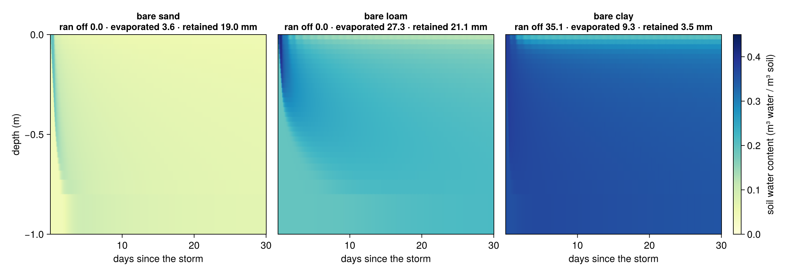
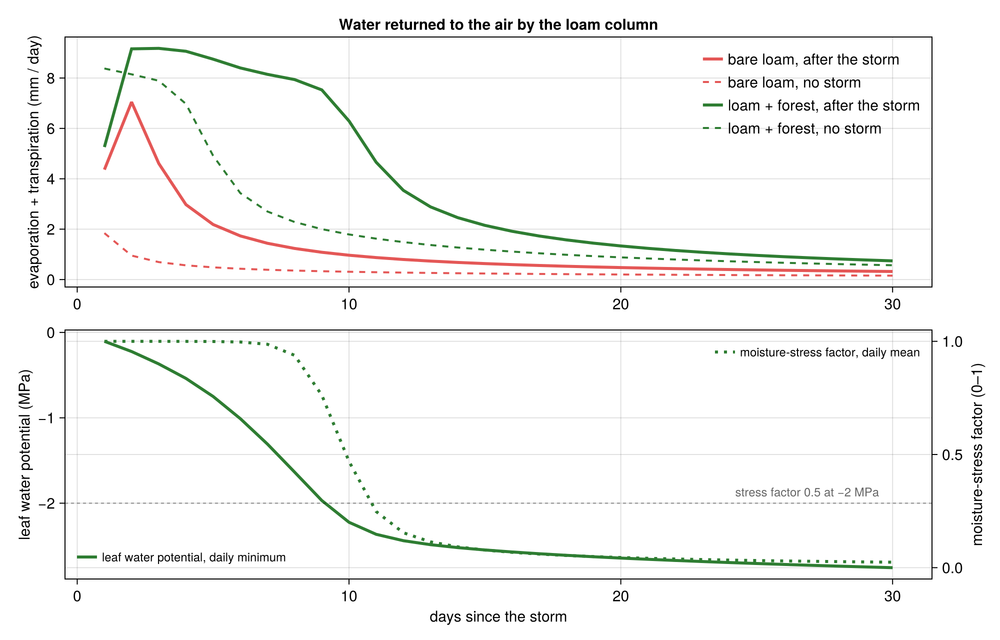
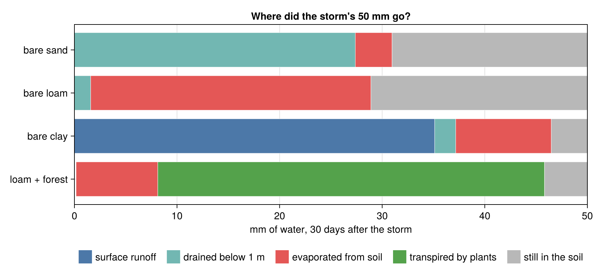
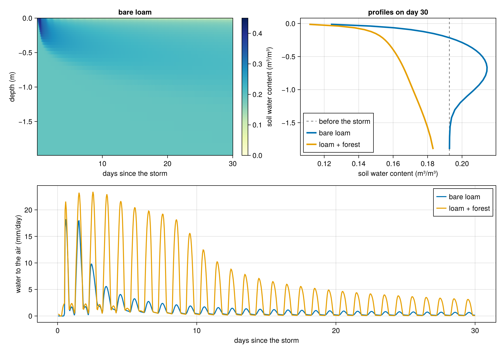

<!-- Draft for the CliMA blog. Figures are in figs/, the reader-facing script is snippet.jl (the excerpt below is inserted from it by build_html.py), the full experiment is rain_experiment.jl + plot_results.jl. -->
<!-- Series number: the 8 September post announced ClimaCore.jl and ClimaTimeSteppers.jl as the next installment, so the part number and the backlinks below must be set once the publication order is decided. -->

*CliMA software stack · Part N · ClimaLand.jl*

# A sponge, a straw, and fifty millimeters of rain

The same storm falls on five patches of ground. A month later the water has gone five different ways, and one patch has lost more than it received. ClimaLand.jl, the land model of the CliMA Earth system model, shows why.

*By Alexis Renchon and the ClimaLand team · September 2026*

Part N of our tour of the CliMA software stack. The series began with [why we built a new Earth system model](https://clima.caltech.edu/2026/07/28/an-entirely-new-earth-system-model-the-first-in-decades/); last week covered [how model parameters are learned from data](https://clima.caltech.edu/2026/09/08/from-tuning-by-hand-to-learning-from-data-climaparams-jl-and-climacalibrate-jl/).

Picture a July night in the middle of a continent. A storm drops fifty millimeters of rain in twelve hours: fifty liters on every square meter, a layer of water five centimeters deep. After the storm, clear weather returns. Where does the water go?

A raindrop on land has four exits. It can **run off** the surface into a ditch and a river. It can **drain** down through the soil toward groundwater. It can **evaporate** from the wet ground. Or it can be pulled up through roots and leaves and **transpired** by a plant. Averaged over the continents, the last two exits together return roughly sixty percent of the rain to the atmosphere, and transpiration is the larger of the two.

How the land splits the rain shapes floods, droughts, and rivers, and it shapes the air above. Evaporation carries energy away from the surface, so a soil that has dried out can no longer cool itself, which is one reason dry springs can amplify summer heat waves, as in Europe in 2003. Water that stays in the soil is the climate system's memory on land: a wet April is still felt in July. And plants open the pores in their leaves to take in carbon dioxide while water escapes through the same pores, so the water cycle and the carbon cycle meet at the surface of every leaf.

ClimaLand.jl computes this partition, along with the energy and carbon exchange that go with it, on a single column or on the whole globe, on CPUs or GPUs, and its parameters can be learned from data with the calibration tools from the previous post. Rather than tour the code, let us run the storm.


***The same storm on five columns.** Each column is one meter of soil, colored by water content, simulated hour by hour with ClimaLand for thirty days after a 50 mm storm that falls between midnight and noon on day 1. The bars follow the storm's own water, computed as this run minus the same column run without the storm: above the surface, what has run off (blue), evaporated (red), and been transpired (green); below, what has drained out of the bottom (teal); and inside the column, a gauge of what is still stored (gray). The five add up to 50 mm at every moment. Root lengths mark the 20th to 95th percentiles of each cover's root profile. The weather is idealized and identical for all five: 19 to 31 °C, 50 percent relative humidity, clear skies once the storm has passed.*

## The sponge

Soil is a sponge. Two properties matter: how fast water gets in, and how tightly it is held once inside. Both depend on the size of the pores, which is to say on texture. Sand has large pores that let water through quickly and hold it weakly. Clay has much smaller pores that admit water slowly and grip it hard. Loam is in between.

ClimaLand describes water movement in soil with the Richards equation: water flows from high to low pressure, plus gravity, with a conductivity that depends steeply on how wet the soil already is. Texture enters through a handful of numbers, the van Genuchten parameters, that set the retention curve and the saturated conductivity. Alongside water, the model solves for the soil's temperature and for freezing and thawing, because they feed back on each other: ice blocks pores, and evaporation cools the surface.

We ran three bare columns with representative properties for sand, loam, and clay. All three start at the same suction, about the dryness at which a plant would still be comfortable, which means they hold very different amounts of water: at that suction sand is nearly dry and clay nearly full. To separate what the storm did from what each column would have done anyway, we ran every column through the same month a second time without the storm. The difference between the two runs is the fate of the storm water itself.



***Water content through depth and time** in the three bare columns. Each title gives the fate of the storm's 50 mm, computed as the storm run minus the no-storm run. In sand the wetting front races downward, reaches the bottom of the column in days, and the surface is dry within hours. In loam the front reaches about 40 cm on the first day and then spreads slowly deeper while the surface dries. In clay the surface cannot admit rain at 4 mm per hour, so most of it runs off.*

The three textures send the same fifty millimeters to three different fates. **Sand passes it down.** The surface dries within hours, and once the top few centimeters are dry they slow further evaporation to a trickle: only 4 mm of the storm evaporates in a month. The wetting front reaches the bottom of the meter within days, 27 mm has drained out toward groundwater by the end of the month, and the other 19 mm is still on its way down. **Loam sends half back to the sky and keeps the rest.** The storm wets the top half meter, capillary flow keeps feeding the drying surface, and 27 mm of the storm evaporates, most of it in the first week; 2 mm drains, and the remaining 21 mm sits in the lower half of the column. **Clay refuses it.** With a saturated conductivity of about two millimeters per hour, the surface takes in only a fraction of the rain: 35 mm of the 50 runs off, 9 mm evaporates, 2 mm drains, and about 4 mm stays. The clay column also evaporates 24 mm of its own water over a month with no storm at all, because it started nearly saturated; the storm barely changes that.

All of these numbers come out of the same equations, driven by the same weather, using representative hydraulic and thermal properties for each texture.

## The straw

Now put plants on the loam. A plant is a straw stuck into the sponge: roots at the bottom, stomata at the top. The pull comes from the dry air. Water evaporates from the wet cell walls inside a leaf, and the drier and warmer the air, the stronger the pull. That tension is transmitted down a continuous column of water through the xylem to the roots and into the soil. A tree on a hot afternoon holds its water column at a tension of one to two megapascals, ten to twenty times atmospheric pressure, in the negative direction.

Stomata close as the tension rises, trading photosynthesis for safety from the embolisms that would break the water column. ClimaLand's canopy model represents this chain with a leaf area and a root profile, a plant hydraulics model that tracks the water potential inside the plant, root uptake from each soil layer driven by the potential difference, and a moisture-stress factor that restricts photosynthesis and stomatal conductance as the leaf potential falls past a set threshold, here two megapascals.

We added two idealized covers to the loam column: a grassland with two square meters of leaf per square meter of ground and 95 percent of its roots in the top 30 cm, and a forest with five square meters of leaf, a taller canopy, and roots spread through the whole meter. The two covers differ in leaf area and height as well as in roots, so what follows is the effect of the whole package.



***Restricting the flow.** Top: water returned to the air each day. Bare-soil evaporation drops sharply in the first week; the vegetated columns keep going at 5 to 9 mm per day. Bottom: the daily minimum of the leaf water potential (solid) and the daily mean of the moisture-stress factor (dashed), the multiplier the model applies to photosynthesis and stomatal conductance.*

In the first week the forest returns nine millimeters a day to the air, more than the bare loam ever manages, because its roots reach water that surface evaporation cannot. That water is not free. The grass, with its roots confined to the top 30 cm, is the first to run short: on day eight its leaves reach a tension of two megapascals at midday and the model's stress factor starts to fall. The forest, drawing on the whole meter, gets there a day later, and over the following three days its stress factor drops from 0.9 to 0.2. Transpiration falls to what the drying soil can supply, and photosynthesis with it. Both covers keep returning water vapor to the air for weeks after the bare soils have gone quiet.



***Where did the storm's water go?** The fate of the 50 mm after thirty days in each column, computed as the storm run minus the no-storm run.*

Under grass and forest the storm is mostly gone within the month: 42 to 46 of the 50 mm went back to the air, 30 to 38 of them through the plants. The more striking number is not in the figure. With no rain at all, the forest column transpires 61 mm in a month and the grass 27 mm, drawn from what the soil held before the storm. Vegetation does not wait for rain; it spends the sponge's reserve. Over the thirty days the forest returned 113 mm to the air, more than twice the storm, and finished the month with 36 mm less in its soil than it started with. This is the everyday physics behind two things that sound like paradoxes: that planting trees can dry the ground beneath them, and that a transpiring canopy stays cooler than dry bare ground on a summer afternoon while drying the soil faster.

## One model for the land, from a column to the globe

The five columns use two of ClimaLand's components: the soil model, which solves for water, ice, and heat, and the canopy model, which handles radiative transfer through the leaves, photosynthesis, stomatal conductance, plant hydraulics, and the canopy's own energy balance. ClimaLand also has a snow model, a soil carbon model with CO₂ diffusion through the pores, and a single-layer bucket model for fast experiments. Each component runs on its own, and they compose into integrated land models that exchange water, energy, and carbon at their interfaces, with the same conservation bookkeeping on one column or on a global cubed-sphere grid.

The model is built on the same foundations as the rest of the stack. ClimaCore.jl supplies the grids and operators, so the same source runs on a laptop CPU and on a cluster of GPUs. Parameters are managed with ClimaParams.jl, which is what lets us calibrate the soil, canopy, and snow components against flux towers and satellite products with ClimaCalibrate.jl, using the ensemble Kalman methods from the [calibration post](https://clima.caltech.edu/2026/09/01/how-can-we-fit-a-climate-model-to-observations-when-no-one-can-predict-the-weather-a-month-from-now/). And the weather can come from an idealized script, as here, from reanalysis, or from the CliMA atmosphere in the coupled Earth system model.

## See for yourself

The reader-facing script [snippet.jl](snippet.jl) builds the bare-loam column and the forest column, runs both for thirty days, and plots the bare column's water content through depth and time, both columns' profiles on day 30, and the water each returns to the air. The two simulations take under a minute on a laptop once the packages are compiled. The excerpt below is the part that defines the two models and runs them; the rest of the script is the idealized weather, the initial state, and the plot.

<!-- SNIPPET -->
```julia
# --- the soil: a loam (van Genuchten parameters from Carsel & Parrish, 1988)
loam = (; ν = 0.43, θ_r = 0.078, K_sat = 2.89e-6, hydrology_cm = vanGenuchten{FT}(; α = 3.6, n = 1.56))
soil(; kw...) = Soil.EnergyHydrology{FT}(domain, forcing, toml_dict; retention_parameters = loam,
    composition_parameters = (; ν_ss_om = 0.0, ν_ss_quartz = 0.4, ν_ss_gravel = 0.0), S_s = 1e-3,
    runoff = Soil.Runoff.SurfaceRunoff(), bottom_bc = Soil.EnergyWaterFreeDrainage(), kw...)
bare = soil()

# --- the same soil under a forest: 5 m² of leaves per m² of ground, roots through the whole meter
components = (:canopy, :soil, :soilco2)
surface = obtain_surface_domain(domain)
LAI = TimeVaryingInput(t -> 5.0)
canopy = Canopy.CanopyModel{FT}(surface, (; atmos, radiation, ground = ClimaLand.PrognosticGroundConditions{FT}()), LAI, toml_dict;
    prognostic_land_components = components,
    biomass = Canopy.PrescribedBiomassModel{FT}(surface, LAI, toml_dict; rooting_depth = 0.4, height = 2.0),   # root density ∝ exp(z / rooting_depth)
    hydraulics = Canopy.PlantHydraulicsModel{FT}(surface, toml_dict; retention_model = Canopy.LinearRetentionCurve{FT}(5e-5)),
    photosynthesis = Canopy.FarquharModel{FT}(surface, toml_dict),
    conductance = Canopy.MedlynConductanceModel{FT}(surface, toml_dict))
forest = SoilCanopyModel{FT}(forcing, LAI, toml_dict, domain;
    soil = soil(; prognostic_land_components = components, additional_sources = (ClimaLand.RootExtraction{FT}(),)), canopy)

# --- run both for 30 days, saving hourly means
function run(model, vars)
    writer = ClimaDiagnostics.Writers.DictWriter()
    diagnostics = ClimaLand.default_diagnostics(model, start_date; output_writer = writer, output_vars = vars, reduction_period = :hourly)
    sim = Sim.LandSimulation(start_date, start_date + Day(30), 60.0, model; set_ic!, updateat = Second(60), user_callbacks = (), diagnostics)
    Sim.solve!(sim)
    return writer
end
out_bare = run(bare, ["swc", "et"])
out_forest = run(forest, ["swc", "et"])
```
<!-- /SNIPPET -->



***What the script produces.** Top right is the take-home in one panel: after a month the bare loam still holds most of what the storm left, as a wet layer below 30 cm, to the right of the pre-storm line, because evaporation only dries the top few centimeters. Under the forest the whole profile sits to the left of that line: the roots have taken the storm and more. The bottom panel shows the hourly rhythm behind the daily totals; its rates are hourly means expressed in mm per day, so the afternoon peaks are not daily totals. Change the soil, the leaf area, or the rooting depth, and rerun.*

The complete experiment, with all five columns, the no-storm control, the water budget, and the animation, is in [rain_experiment.jl](rain_experiment.jl) and [plot_results.jl](plot_results.jl). The [ClimaLand documentation](https://clima.github.io/ClimaLand.jl/stable/) has tutorials that go from a single soil column to a global simulation driven by reanalysis data.

> **Notes on the setup**
>
> **Weather.** The forcing is idealized so that the five columns differ only in soil and vegetation: a clear-sky July at 38.7 °N with air at 19 to 31 °C, 50 percent relative humidity, a 2 m/s wind, and the sun's path computed for the date; the storm brings 95 percent humidity and overcast skies for its twelve hours. All columns start at a matric potential of −2 m (about −20 kPa) at every depth, with free drainage out of the bottom at 1 m. The no-storm control is the same month with the rain, the humidity spike, and the clouds removed.
>
> **Soils.** Van Genuchten parameters are the textbook values of Carsel and Parrish (1988): sand (porosity 0.43, residual 0.045, α = 14.5 m⁻¹, n = 2.68, Ksat = 8.3 × 10⁻⁵ m/s), loam (0.43, 0.078, 3.6, 1.56, 2.9 × 10⁻⁶) and clay (0.38, 0.068, 0.8, 1.09, 5.6 × 10⁻⁷). The clay's 70 percent runoff follows from the model's infiltration rule, which caps infiltration at what the saturated surface can conduct; field clays with cracks and worm channels admit water faster than that.
>
> **Plants.** Grass: leaf area index 2, canopy height 0.5 m, root e-folding depth 0.1 m. Forest: leaf area index 5, height 2 m, root e-folding depth 0.4 m. Root density decays exponentially with depth and the profile is not renormalized to the column, so these values put 95 percent of the grass roots in the top 30 cm and 92 percent of the forest roots inside the one-meter column. Two choices depart from ClimaLand's defaults. We use the Farquhar photosynthesis model with Medlyn stomatal conductance, under which the moisture-stress factor acts on stomata within the hour; the default P-model applies the same factor through a two-week acclimation of photosynthetic capacity, which suits seasonal simulations but left leaf potentials falling with no stomatal response in a dry-down this short. And we lowered the plant's water storage capacitance to about ten millimeters per megapascal for the forest, because the default lets a model canopy transpire from its own tissue water for weeks. With this value the forest's leaf potential fell by 2.7 MPa over the month, so about 27 mm of its transpiration came from that store; real stands likely hold less, and this part of the model is being revised ([issue 1873](https://github.com/CliMA/ClimaLand.jl/issues/1873)). All numbers in this post are model results under these assumptions, not a validation against observations.

---

ClimaLand.jl is developed by the Climate Modeling Alliance at Caltech and is open source on [GitHub](https://github.com/CliMA/ClimaLand.jl); the full list of contributors is there. The simulations in this post were run with ClimaLand v1.12.1 on Julia 1.12, in the repository's `.buildkite` environment.
